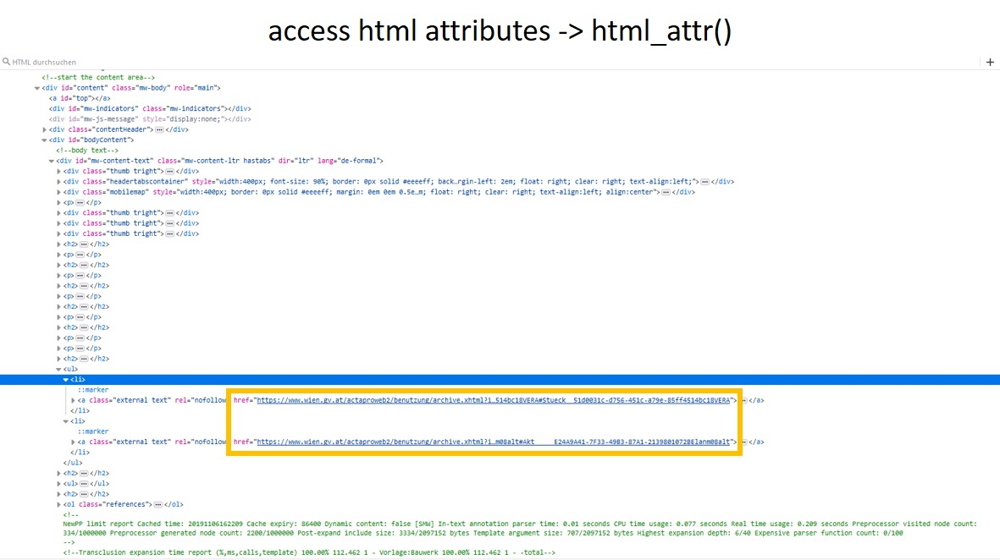

``` r
if (!require("edgarWebR")) install.packages("edgarWebR")
if (!require("RSelenium")) install.packages("RSelenium")
if (!require("rvest")) install.packages("rvest")
if (!require("tidyverse")) install.packages("tidyverse")
if (!require("WDI")) install.packages("WDI")

library(rvest)
library(tidyverse)
```

Introduction
============

**Definition**  
*In a nutshell, web scraping is the process of extracting data from
websites. All the job is carried out by a piece of code which is called
a “scraper”.*  
[upwork.com](https://www.upwork.com/hiring/for-clients/web-scraping-tutorial/).


Fundamental considerations
==========================

[Get to top](#introduction)

-   Where do I get data
    -   [Do I need web scraping?](#do-i-need-web-scraping?)
    -   [Is there a package / library?](#is-there-a-package-/-library?)
-   What data do I want?
    -   [Is data stored in files?](#is-data-stored-in-files?)
    -   [How is data structured? (e.g. text, tables, attributes)](#how-is-data-structured?)
    -   [Is interaction needed? (e.g. event-based code, forms)](#is-interaction-needed?)
-   How do I get data?
    -   [How do I access data? (i.e. access website A to get to
        website B)](#how-do-i-access-data?)
    -   [How do I identify data? (e.g. xpath, css-selector)](#how-do-i-identify-data?)
    -   [Is my identifier unique?](#is-my-identifier-unique?)
    -   [Is my identifier stable?](#is-my-identifier-stable?)
 -  [Legal aspects](#legal-aspects)
 -  [Additional resources](#additional-resources)

Where do I get data?
====================

Do I need web scraping?
-----------------------

[Get to top](#introduction)

This comes down to the question “Is it worth the effort?”. Web scraping
is most efficient when…

-   …the website provides no interface to access data (e.g. [World
    Bank](https://databank.worldbank.org/source/world-development-indicators))
-   …you would have to repeat the same web-based task several times.
-   …the website structure is known and consistent. –\> Is my identifier
    unique? / Is my identifier consistent?
-   …the website allows you to webscrap. –\> Legal aspects

Is there a package / library?
-----------------------------

[Get to top](#introduction)

In some cases there are packages / libraries available that make web
scaping unnecessary:

------------------------------------------------------------------------

**World Bank**

``` r
WDI::WDI(country = c("US","BR"), indicator = "NY.GNS.ICTR.GN.ZS", start = 1999, end = 2000, extra = TRUE, cache = NULL)
```

------------------------------------------------------------------------

**Securities and Exchange Commission**

``` r
edgarWebR::company_filings("AAPL", before = "20170810", count = 10)
```

What data do I want?
====================

Is data stored in files?
------------------------

[Get to top](#introduction)

------------------------------------------------------------------------

**saving stored files**
Downloading and saving a file from a
[website](https://www.wu.ac.at/iib/team).

``` r
url <- "https://www.wu.ac.at/fileadmin/wu/_processed_/3/e/csm_WU_IIB_GroupPicture-1_ca2bfa13bc.jpg"

download.file(url, "out.jpg", mode = "wb")
```

------------------------------------------------------------------------

**reading stored files**  
Downloading a file from a
[website](https://www.stats.govt.nz/information-releases/annual-enterprise-survey-2018-financial-year-provisional)
and importing it directly into R. The website prevents web scraping in
its *robots.txt* file - see below.

``` r
url <- "https://www.stats.govt.nz/assets/Uploads/Annual-enterprise-survey/Annual-enterprise-survey-2018-financial-year-provisional/Download-data/annual-enterprise-survey-2018-financial-year-provisional-csv.csv"

read_csv(url)
```

------------------------------------------------------------------------

**reading data**  
Accessing [website](https://de.wikipedia.org/wiki/Marcus_Tullius_Cicero)
content and saving this content as an object in R. – Focus of this
document!

``` r
url <- "https://de.wikipedia.org/wiki/Marcus_Tullius_Cicero"

url %>%
  read_html() %>%
  html_nodes("#firstHeading") %>%
  html_text()
```

How is data structured?
-----------------------

[Get to top](#introduction)

Data on a [website](https://www.geschichtewiki.wien.gv.at/Gasometer) can
be categorized into three broard groups: text, tables, and attributes.
Regardless of these types, web scraping always consists three steps:

1.  access html site
2.  access html nodes
3.  extract information

However, *extracting* information differs depending on these groups.

------------------------------------------------------------------------

**accessing html site**  


``` r
url <- "https://www.geschichtewiki.wien.gv.at/Gasometer"

data_site <- read_html(url)
print(data_site)
```

*Python example*

``` python
# import packages
from lxml import html
import requests

# connect to webpage
url = "https://www.geschichtewiki.wien.gv.at/Gasometer"
resp = requests.get(url, headers={'User-Agent': 'Custom'})

# download webpage
page = html.fromstring(resp.content)
```

------------------------------------------------------------------------

**accessing html nodes**  


``` r
url <- "https://www.geschichtewiki.wien.gv.at/Gasometer"

data_nodes <- url %>%
  read_html() %>%
  html_nodes(".text")
print(data_nodes)

# subsetting html nodes like list
print(data_nodes[[2]])
```

*Python example*

``` python
# import packages
from lxml import html
import requests

# connect and download webpage
url = "https://www.geschichtewiki.wien.gv.at/Gasometer"
resp = requests.get(url, headers={'User-Agent': 'Custom'})
page = html.fromstring(resp.content)

# download elements
page = html.fromstring(resp.content)
web_data = page.cssselect(".text")
```

------------------------------------------------------------------------

**text data**  
*html\_text()* extracts the *text* content of html nodes. The output is
a character vector.  


``` r
url <- "https://www.geschichtewiki.wien.gv.at/Gasometer"

url %>%
  read_html %>%
  html_nodes(".text") %>%
  html_text()
```

*Python example*

``` python
# import packages
from lxml import html
import requests

# connect and download webpage
url = "https://www.geschichtewiki.wien.gv.at/Gasometer"
resp = requests.get(url, headers={'User-Agent': 'Custom'})
page = html.fromstring(resp.content)

# download elements
page = html.fromstring(resp.content)
web_data = page.cssselect(".text")

# print element text
web_test = []
for i in web_data:
  web_test.append(i.text)
```

------------------------------------------------------------------------

**tables**  
*html\_table()* extracts tables that are defined by a *\<table\>* tag
from html nodes. The output ist a list of data frames.  


``` r
url <- "https://www.geschichtewiki.wien.gv.at/Gasometer"

url %>%
  read_html %>%
  html_nodes("table") %>%
  html_table()
```

------------------------------------------------------------------------

**attributes**  
*html\_attr()* extracts attributes that are defined by the respective
*\<tag\>* indicated in the *html\_attr()* function from html nodes. The
output is a character vector.  


``` r
url <- "https://www.geschichtewiki.wien.gv.at/Gasometer"

url %>%
  read_html %>%
  html_nodes(".text") %>%
  html_attr("href")
```

*Python example*

``` python
# import packages
from lxml import html
import requests

# connect and download webpage
url = "https://www.geschichtewiki.wien.gv.at/Gasometer"
resp = requests.get(url, headers={'User-Agent': 'Custom'})
page = html.fromstring(resp.content)

# download elements
page = html.fromstring(resp.content)
web_data = page.cssselect(".text")

# print element href attribute
web_test = []
for i in web_data:
  web_test.append(i.attrib.get('href'))
```

Is interaction needed?
----------------------

[Get to top](#introduction)

------------------------------------------------------------------------

**loading data**  
Some websites are built in a way that data is only loaded after when the
website is opened - the data is part of the “as-loaded” website but not
part of the “as-is”
[website](https://www.liveticker.com/turnierbaum/zLZKqTTF/ATnr2OzD/#draw).
Since *rvest* loads “as-is” websites, data that is part of the
“as-loaded” webite cannot be accessed.

``` r
url <- "https://www.liveticker.com/turnierbaum/zLZKqTTF/ATnr2OzD/#draw"

url %>%
  read_html() %>%
    html_nodes(xpath = "//*[@id='match-0-0']") %>%
    html_text()
```

The package *RSelenium* uses the testing mode of the browser to open a
[website](https://www.liveticker.com/turnierbaum/zLZKqTTF/ATnr2OzD/#draw)
before the actual scraping starts. This provides access to the
“as-loaded” website.

``` r
# open server session and open browser client
rD <- rsDriver(browser = c("chrome"), chromever = "latest", verbose = FALSE)
# binman::list_versions("chromedriver")
# rD <- rsDriver(browser = c("chrome"), chromever = "79.0.3945.36", verbose = FALSE)
remDr <- rD$client

# navitage to url in browser client
url <- "https://www.liveticker.com/turnierbaum/zLZKqTTF/ATnr2OzD/#draw"
remDr$navigate(url)

# access single webnelement using xpath
webElem <- remDr$findElement(using = "xpath", "//*[@id='match-0-0']")
webElem$getElementText()

# close browser client and close server session
remDr$close()
rD$server$stop()
```

------------------------------------------------------------------------

**entering data**  
Through the browser testing mode *RSelenium* can also be used provide
browser inputs. The example below is from the RSelenium
[documentation](https://ropensci.github.io/RSelenium/articles/basics.html#sending-events-to-elements).

``` r
# open server session and open browser client
rD <- rsDriver(browser = c("chrome"), chromever = "79.0.3945.36", verbose = FALSE)
remDr <- rD$client

# open website, enter data, and press button
remDr$navigate("http://www.google.com/ncr")
webElem <- remDr$findElement(using = "css", "[name = 'q']")
webElem$sendKeysToElement(list("R Cran", key = "enter"))

# get elements from new website
webElems <- remDr$findElements(using = "css selector", "h3.r")
resHeaders <- unlist(lapply(webElems, function(x) {x$getElementText()}))
webElem <- webElems[[which(resHeaders == "R for Windows")]]

# click element on new website
webElem$clickElement()

# get results
remDr$getCurrentUrl()
remDr$getTitle()

# close browser client and close server session
remDr$close()
rD$server$stop()
```

How do I get data?
==================

How do I access data?
---------------------

[Get to top](#introduction)

If data is saved on sub-pages it might be necessary to scrap data
(e.g. URLs) from [website
A](https://de.wikipedia.org/wiki/Kategorie:Kaiser_(Rom)) and use these
URLs to access [website
B](https://de.wikipedia.org/wiki/Aemilianus_(Kaiser)) where the actual
data is scraped.

------------------------------------------------------------------------

``` r
url <- "https://de.wikipedia.org/wiki/Kategorie:Kaiser_(Rom)"

# scrap urls for page B from page A
url_b <- url %>%
  read_html() %>%
  html_nodes("#mw-pages a") %>%
  html_attr("href")

# scrap data from page B
str_c("https://de.wikipedia.org", url_b) %>%
  map_chr(~{
    read_html(.x) %>%
    html_nodes("#firstHeading") %>%
    html_text()
  })
```

How do I identify data?
-----------------------

[Get to top](#introduction)

For web scraping, a clear identification of the data is necessary. Data
on a website can by identfied using its URL (e.g. for files linked to
the website), the data’s xpath, or its css style.

------------------------------------------------------------------------

**xpath**  
The xpath is the address of an object within the
[website](https://www.marketwatch.com/investing/stock/IRS/profile)’s
code. The xpath can be copied from the browser’s developer view (Ctrl +
I).

``` r
url <- "https://www.marketwatch.com/investing/stock/IRS/profile"

url %>%
  read_html() %>%
  html_nodes(xpath = '//*[@id="maincontent"]/div[2]/div/div/p') %>%
  html_text()
```

Using different xpaths might lead to the same / similar results for
[website](https://www.marketwatch.com/investing/stock/IRS/profile)
elements - but could also result in differing / unstable results.

``` r
url <- "https://www.marketwatch.com/investing/stock/IRS/profile"

url %>%
  read_html() %>%  
  html_nodes(xpath = '//*[@class="section"]') %>%
  html_text() %>%
  str_squish()
```

The xpath for
[website](http://www.taipeitimes.com/News/front/archives/2020/01/12/2003729107)
elements can also use wildcards in the form *contains()*.

``` r
url <- "http://www.taipeitimes.com/News/front/archives/2020/01/12/2003729107"

len_a <- url %>%
  read_html() %>%
  html_nodes(xpath = '//*[@id="front_boxd"]/h1') %>%
  length()

len_b <- url %>%
  read_html() %>%
  html_nodes(xpath = '//*[contains(@id, "_boxd")]') %>%
  length()

print(len_a)
print(len_b)
print(len_a == len_b)
```

------------------------------------------------------------------------

**css styles**  
The easiest way to identify
[website](https://www.marketwatch.com/investing/stock/IRS/profile) data
is using
[selectorgadet](https://cran.r-project.org/web/packages/rvest/vignettes/selectorgadget.html)
to identify its css style.

``` r
url <- "https://www.marketwatch.com/investing/stock/IRS/profile"

url %>%
  read_html() %>%  
  html_nodes("#maincontent .section p") %>%
  html_text()
```

Is my identifier unqiue?
------------------------

[Get to top](#introduction)

Defining a selector that is not sufficiently unambiguous might lead to
undesirable result -\> too many / unwanted results.

------------------------------------------------------------------------

**xpath**  
Depending on the
[website](https://www.transfermarkt.de/adi-hutter/profil/trainer/5018)
structure, an ambiguous xpath might result in too many results /
unwanted results.

``` r
url <- "https://www.transfermarkt.de/adi-hutter/profil/trainer/5018"
xpath_selector <- '//*[@id="main"]/div[8]/div/div[1]/div[2]/div/div[1]/p[1]/span[2]'

len_a <- url %>%
  read_html() %>%
  html_nodes(xpath = xpath_selector) %>%
  length()

xpath_selector <- '//*[@id="main"]/div[8]/div/div[1]/div[2]/div/div/p/span'

len_b <- url %>%
  read_html() %>%
  html_nodes(xpath = xpath_selector) %>%
  length()

print(len_a)
print(len_b)
print(len_a == len_b)
```

------------------------------------------------------------------------

**css styles**  
Depending on the
[website](https://followinghadrian.com/2019/10/15/the-forest-inscriptions-of-hadrian-in-mount-lebanon/)
structure, an ambiguous css style selector might result in too many
results / unwanted results.

``` r
url <- "https://followinghadrian.com/2019/10/15/the-forest-inscriptions-of-hadrian-in-mount-lebanon/"
css_selector <- ".wp-caption-text"

len_a <- url %>%
  read_html() %>%
  html_nodes(css_selector) %>%
  length()

css_selector <- "#caption-attachment-13802"

len_b <- url %>%
  read_html() %>%
  html_nodes(css_selector) %>%
  length()

print(len_a)
print(len_b)
print(len_a == len_b)
```

Is my identifier stable?
------------------------

[Get to top](#introduction)

When looping across a list of websites it might happen that an
identifier that worked on *page A* does not work anymore on *page B*.

------------------------------------------------------------------------

**xpath**  
xpath, that does not account for changes in the website design between
[page A](https://de.wikipedia.org/wiki/Augustus) and [page
B](https://de.wikipedia.org/wiki/Trajan):

``` r
url_a <- "https://de.wikipedia.org/wiki/Augustus"
url_b <- "https://de.wikipedia.org/wiki/Trajan"
xpath_selector <- '//*[@id="mw-content-text"]/div/p[1]/b'

len_a <- url_a %>%
  read_html() %>%
  html_nodes(xpath = xpath_selector) %>%
  length()

len_b <- url_b %>%
  read_html() %>%
  html_nodes(xpath = xpath_selector) %>%
  length()

print(len_a)
print(len_b)
print(len_a == len_b)
```

xpath, that does account for changes in the website design between [page
A](https://de.wikipedia.org/wiki/Augustus) and [page
B](https://de.wikipedia.org/wiki/Trajan):

``` r
url_a <- "https://de.wikipedia.org/wiki/Augustus"
url_b <- "https://de.wikipedia.org/wiki/Trajan"
xpath_selector <- '//*[@id="mw-content-text"]/div/p[1]/b[1]' # changing 'b' to 'b[1]' for less ambiguity

len_a <- url_a %>%
  read_html() %>%
  html_nodes(xpath = xpath_selector) %>%
  length()

len_b <- url_b %>%
  read_html() %>%
  html_nodes(xpath = xpath_selector) %>%
  length()

print(len_a)
print(len_b)
print(len_a == len_b)
```

------------------------------------------------------------------------

**css styles**  
css style, that does not account for changes in the website design
between [page
A](https://www.metacritic.com/browse/games/score/metascore/all/ps4?sort=desc&page=6)
and [page
B](https://www.metacritic.com/browse/games/score/metascore/all/ps4?sort=desc&page=7):

``` r
url_a <- "https://www.metacritic.com/browse/games/score/metascore/all/ps4?sort=desc&page=6"
url_b <- "https://www.metacritic.com/browse/games/score/metascore/all/ps4?sort=desc&page=7"
css_selector <- "#main .positive"

len_a <- url_a %>%
  read_html() %>%
  html_nodes(css_selector) %>%
  length()

len_b <- url_b %>%
  read_html() %>%
  html_nodes(css_selector) %>%
  length()

print(len_a)
print(len_b)
print(len_a == len_b)
```

css style, that does account for changes in the website designbetween
[page
A](https://www.metacritic.com/browse/games/score/metascore/all/ps4?sort=desc&page=6)
and [page
B](https://www.metacritic.com/browse/games/score/metascore/all/ps4?sort=desc&page=7):

``` r
url_a <- "https://www.metacritic.com/browse/games/score/metascore/all/ps4?sort=desc&page=6"
url_b <- "https://www.metacritic.com/browse/games/score/metascore/all/ps4?sort=desc&page=7"
css_selector <- "#main .game"

len_a <- url_a %>%
  read_html() %>%
  html_nodes(css_selector) %>%
  length()

len_b <- url_b %>%
  read_html() %>%
  html_nodes(css_selector) %>%
  length()

print(len_a)
print(len_b)
print(len_a == len_b)
```

Legal aspects
=============

[Get to top](#introduction)

Not all website allow web scraping, either in their usage terms or through their *robots.txt* file. See [this blog entry](https://ryo-n7.github.io/2020-05-14-webscrape-soccer-data-with-R/) for further considerations.

<https://www.marketwatch.com/support/disclaimer.asp>  
3.4 No Modification of Content. You agree not to rearrange or modify the
Content. You agree not to create abstracts from, scrape or display
headlines from the Content for use on another web site or service or use
the Content for commercial purposes, including without limitation
algorithmic trading programs. You agree not to upload, post or submit
any Content from the Services to weblogs, newsgroups, mail lists or
electronic bulletin boards, except through services we specifically
provide for that purpose (e.g., an RSS Feed) or after we give our
written consent in advance.

------------------------------------------------------------------------

<https://moz.com/learn/seo/robotstxt>  
User-agent: \*  
Disallow: /  
Using this syntax in a robots.txt file would tell all web crawlers not
to crawl any pages on www.example.com, including the homepage.

Additional resources
====================

[Get to top](#introduction)

[Beckman, M., Guerrier, S., Lee, J., Molinari, R., Orso, S., &
Rudnytskyi, I. (2019). Web scraping in R. In An Introduction to
Statistical Programming Methods with
R.](https://smac-group.github.io/ds/web-scraping-in-r.html)  
[Udemy - Automate the Boring Stuff with Python
Programming](https://www.udemy.com/course/automate/)  
[w3schools.com - XPath
Tutorial](https://www.w3schools.com/xml/xpath_intro.asp)
